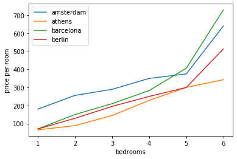

# How to Increase Your Airbnb Income

In this blog post, I will share some insights from data analysis of four European cities: Amsterdam, Barcelona, Berlin and Athens. I will show you how factors such as size, seasonality, location and amenities affect the price and occupancy rate of Airbnb listings. I will also give you some tips and tools that you can use to boost your Airbnb income and attract more guests to your listing.

Here is an image:

